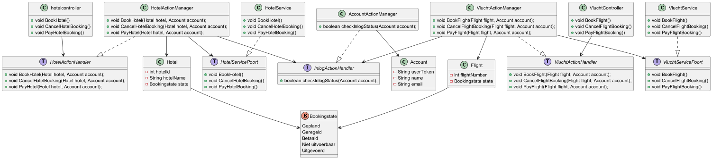

# Pressure cooker

## Onderzoeksvraag
**Hoe kunnen we ervoor zorgen dat een bouwsteen alleen bepaalde acties toestaat wanneer deze zich in een specifieke toestand bevindt?**

## Componenten:
| Component           | Naam                | Verantwoordelijkheid                                                                                                                                      |
|---------------------|---------------------|-----------------------------------------------------------------------------------------------------------------------------------------------------------|
| HotelActionHandler  | HotelActionHandler  | Beheert of acties met betrekking tot hotels mogen worden uitgevoerd afhankelijk van de status.                                                            |
| InlogActionHandler  | InlogActionHandler  | Beheert of inlog- en accountbeheeracties, zoals authenticatie en autorisatie. houd daarnaast ook bij of de acties uitgevoerd kan worden door het account. |
| VluchtActionHandler | VluchtActionHandler | Beheert of acties met betrekking tot vluchten mogen worden uitgevoerd afhankelijk van de status.                                                          |

## InterFaces
### HotelActionHandler
 - public void BookHotel(Hotel hotel, Account account);
 - public void CancelHotelBooking(Hotel hotel, Account account);
 - public void PayHotel(Hotel hotel, Account account);

### InlogActionHandler
 - public boolean checkInlogStatus(Account account);

### VluchtActionHandler
- public void BookFlight(Flight flight, Account account);
- public void CancelFlightBooking(Flight flight, Account account);
- public void PayFlight(Flight flight, Account account);

## Dynamisch component diagram

## Class diagram
