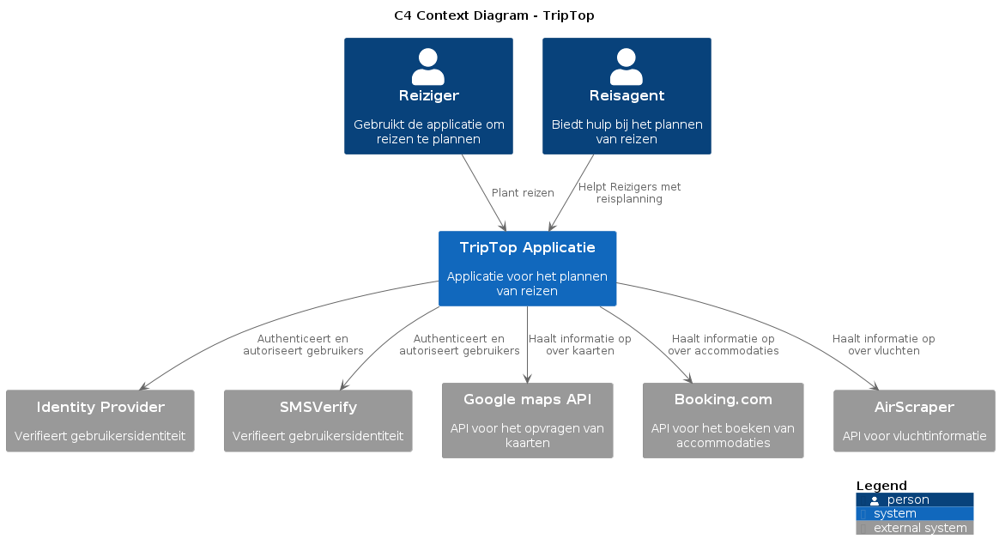
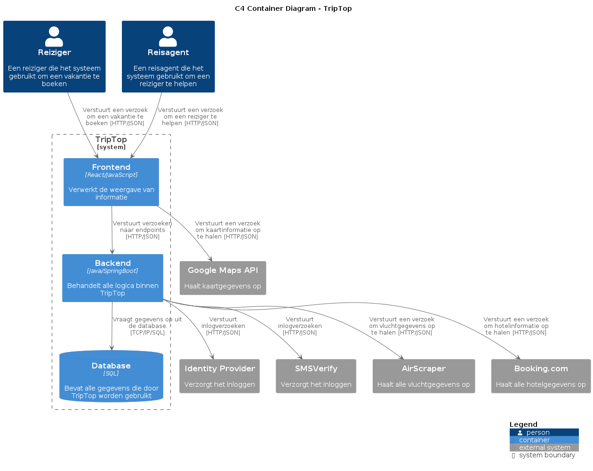
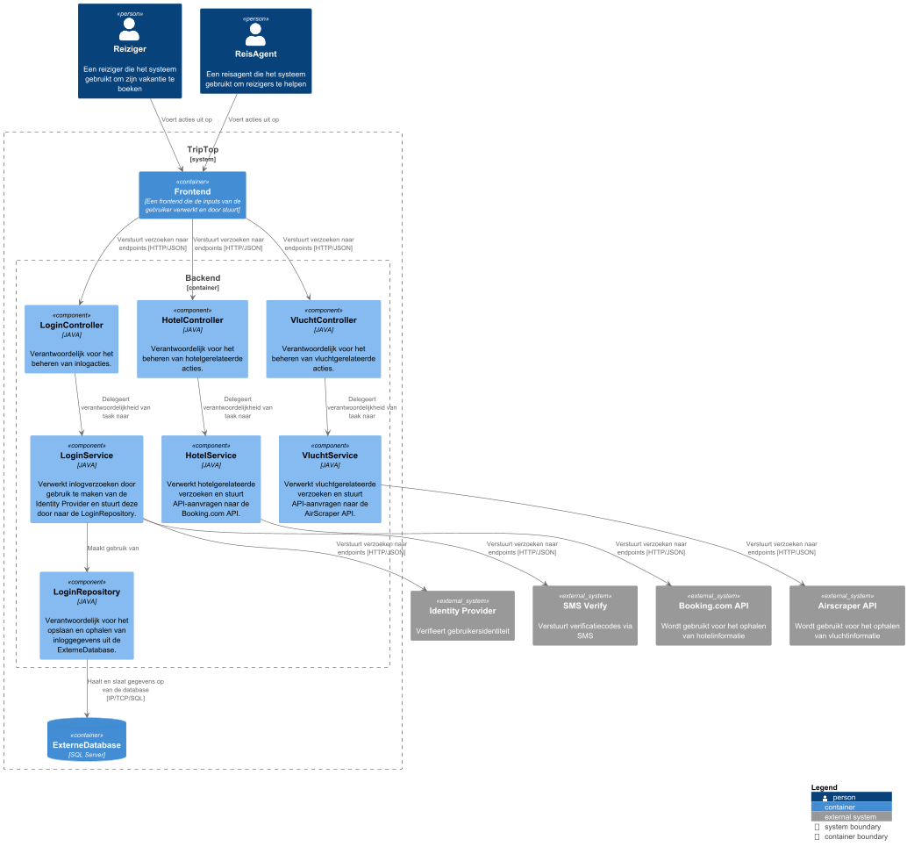
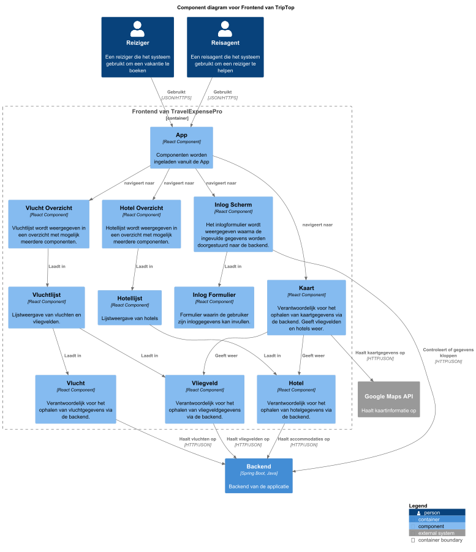
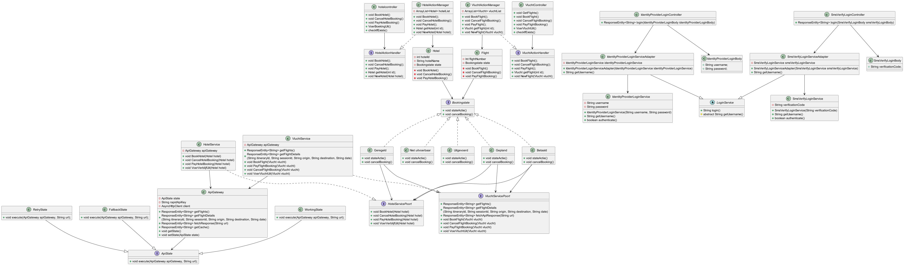
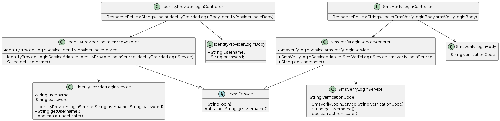

# Software Guidebook Triptop

## 1. Introduction
Dit software guidebook geeft een overzicht van de Triptop-applicatie. Het bevat een samenvatting van het volgende: 
1. De vereisten, beperkingen en principes. 
1. De software-architectuur, met inbegrip van de technologiekeuzes op hoog niveau en de structuur van de software. 
1. De ontwerp- en codebeslissingen die zijn genomen om de software te realiseren.
1. De architectuur van de infrastructuur en hoe de software kan worden geïnstalleerd.

## 2. Context
De TripTop applicatie is ontworpen als een platform voor het plannen van reizen. Gebruikers
kunnen reizen organiseren en accommodaties en vluchten boeken via externe API's die zijn
geïntegreerd in de applicatie. Reizigers en reisagenten gebruiken de applicatie voor
reisplanning, waarbij de reizigers hun reis plannen en de reisagenten ondersteuning bieden
bij het plannen van reizen.

### 2.1. Functionaliteit
De functionaliteiten van de applicatie omvatten:
* Reisplanning: Gebruikers kunnen accommodaties en vluchten boeken.
* Kaartweergave: De applicatie kan kaarten tonen met locaties van accommodaties en vluchten via
de integratie van de Google Maps API.
* Authenticatie en autorisatie: Gebruikers worden geauthenticeerd en geautoriseerd via een
externe Identity Provider.

### 2.2. Gebruikers
Het team heeft ervoor gekozen om twee typen gebruikers in de applicatie op te nemen:
* Reiziger: Dit is de belangrijkste gebruiker van de applicatie. De reiziger gebruikt
de applicatie om hun reizen te plannen, waaronder het boeken van accommodaties en het
zoeken naar geschikte vluchten.
* Reisagent: Deze gebruiker helpt de reiziger met het plannen van hun reis door advies
te geven een aanbevelingen te doen over routes, accommodaties en vluchten. De reisagent
dient als een ondersteunende rol voor de reiziger.

Deze twee gebruikersrollen zijn gekozen, omdat ze de belangrijkste actoren zijn die in
de casus worden genoemd.

### 2.3. Externe systemen
Er zijn vier externe systemen geïntegreerd in de TripTop applicatie:
1. Google Maps API

Deze API wordt gebruikt om kaarten en locaties op te vragen. Het zorgt ervoor dat gebruikers routes kunnen 
visualiseren en bestemmingen kunnen vinden binnen de applicatie.
2. Booking.com API

Via deze API kunnen gebruikers accommodaties vinden en boeken op basis van hun specifieke wensen. De 
API zorgt voor toegang tot de database van accommodaties, inclusief prijzen en beschikbaarheid.

3. AirScraper API

Deze API biedt informatie over vluchten, luchthavens en prijzen van vluchten. Het stelt gebruikers
in staat om vluchten te zoeken en te boeken die aan hun reisplannen voldoen.

4. Identity Provider

De applicatie maakt gebruik van een externe identity provider voor de authenticatie en autorisatie 
van gebruikers. Dit externe systeem zorgt ervoor dat gebruikers zich veilig kunnen aanmelden in de 
applicatie en hun identiteit wordt gecontroleerd, zonder dat de applicatie zelf verantwoordelijk is
voor het beheer van wachtwoorden of inloggegevens.

5. SMS Verify

SMS Verify biedt een mogelijkheid tot inloggen.
Bij het registeren kunnen gebruikers hiervoor kiezen, waarbij ze hun telefoonnummer dienen in te voeren.
Met dit telefoonnummer kan daarna ingelogd worden.
Er hoeft dus geen gebruikersnaam of wachtwoord opgeslagen te worden.

## 3. Functional Overview

Om de belangrijkste features toe te lichten zijn er user stories en twee domain stories gemaakt en een overzicht van het domein in de vorm van een domeinmodel. Op deze plek staat typisch een user story map maar die ontbreekt in dit voorbeeld.

### 3.1 User Stories

#### 3.1.1 User Story 1: Reis plannen

Als gebruiker wil ik een zelfstandig op basis van diverse variabelen (bouwstenen) een reis kunnen plannen op basis van mijn reisvoorkeuren (wel/niet duurzaam reizen, budget/prijsklasse, 's nachts reizen of overdag etc.) zodat ik op vakantie kan gaan zonder dat hiervoor een reisbureau benodigd is.

#### 3.1.2 User Story 2: Reis boeken

Als gebruiker wil ik een geplande reis als geheel of per variabele (bouwsteen) boeken en betalen zodat ik op vakantie kan gaan zonder dat hiervoor een reisbureau benodigd is.

#### 3.1.3 User Story 3: Reis cancelen

Als gebruiker wil ik een geboekte reis, of delen daarvan, kunnen annuleren zodat ik mijn geld terug kan krijgen zonder inmenging van een intermediair zoals een reisbureau.

#### 3.1.4 User Story 4: Reisstatus bewaren 

Als gebruiker wil ik mijn reisstatus kunnen bewaren zonder dat ik een extra account hoef aan te maken zodat ik mijn reis kan volgen zonder dat ik daarvoor extra handelingen moet verrichten.

#### 3.1.5 User Story 5: Bouwstenen flexibel uitbreiden

Als gebruiker wil ik de bouwstenen van mijn reis flexibel kunnen uitbreiden met een zelf te managen stap (bijv. met providers die niet standaard worden aangeboden zoals een andere reisorganisatie, hotelketen etc.) zodat ik mijn reis helemaal kan aanpassen aan mijn wensen.

### 3.2 Domain Story Reis Boeken (AS IS)

### 3.3 Domain Story Reis Boeken (TO BE)

### 3.4 Domain Model

### 3.5 Mapping Domain Model van/naar de APIs
| Class::attribuut                 | Is input voor API + Endpoint          | Wordt gevuld door API + Endpoint | Wordt geleverd door eindgebruiker | Moet worden opgeslagen in de applicatie |
|----------------------------------|---------------------------------------|----------------------------------|-----------------------------------|-----------------------------------------|
| Trip::startDatum                 |                                       |                                  | x                                 |                                         |
| Trip::eindDatum                  |                                       |                                  | x                                 |                                         |
| Trip::budget                     |                                       |                                  | x                                 |                                         |
| Verblijf::startDatum             |                                       |                                  | x                                 | x                                       |
| Verblijf::eindDatum              |                                       |                                  | x                                 | x                                       |
| Verblijfplaats::locatie          | Booking/getHotelDetails (GET)         | Booking/getHotelDetails          |                                   | x                                       |
| Verblijfplaats::prijs            | Booking/getHotelDetails (GET)         | Booking/getHotelDetails          |                                   | x                                       |
| Reis::startDatum                 | AirScraper/searchFlightsComplete(GET) | AirScraper/searchFlightsComplete |                                   | x                                       |
| Reis::eindDatum                  | AirScraper/searchFlightsComplete(GET) | AirScraper/searchFlightsComplete |                                   | x                                       |
| Reis::prijs                      | AirScraper/searchFlightsComplete(GET) | AirScraper/searchFlightsComplete |                                   | x                                       |
| Reis::vervoer                    |                                       |                                  | x                                 |                                         |
| Locatie::lat                     | Google Maps API / ?  (?)              | Google Maps API / ?              |                                   | x                                       |
| Locatie::lon                     | Google Maps API / ?  (?)              | Google Maps API / ?              |                                   | x                                       |
| Excursie::titel                  | n.v.t.                                | n.v.t.                           | n.v.t.                            | n.v.t.                                  |
| Excursie::datum                  | n.v.t.                                | n.v.t.                           | n.v.t.                            | n.v.t.                                  |
| Excursie::startTijd              | n.v.t.                                | n.v.t.                           | n.v.t.                            | n.v.t.                                  |
| Excursie::eindTijd               | n.v.t.                                | n.v.t.                           | n.v.t.                            | n.v.t.                                  |
| Excursie::prijs                  | n.v.t.                                | n.v.t.                           | n.v.t.                            | n.v.t.                                  |
| Reiziger::telefoonnummer         |                                       |                                  | x                                 | x                                       |
| Reiziger::postcode               |                                       |                                  | x                                 | x                                       |
| Reiziger::huisnummer             |                                       |                                  | x                                 | x                                       |
| Reservering::reserveringsnummer  |                                       |                                  | x                                 | x                                       |
| Reservering::status              |                                       |                                  | x                                 | x                                       |
| TriptopGebruiker::voornaam       |                                       |                                  | x                                 | x                                       |
| TriptopGebruiker::tussenvoegsels |                                       |                                  | x                                 | x                                       |
| TriptopGebruiker::achternaam     |                                       |                                  | x                                 | x                                       |
| TriptopGebruiker::email          |                                       |                                  | x                                 | x                                       |
| TriptopGebruiker::wachtwoord     |                                       |                                  | x                                 | x                                       |
| Reisbureaumedewerker::titel      |                                       |                                  | x                                 | x                                       |

## 4. Quality Attributes

Voordat deze casusomschrijving tot stand kwam, heeft de opdrachtgever de volgende ISO 25010 kwaliteitsattributen benoemd als belangrijk:
* Compatibility -> Interoperability (Degree to which a system, product or component can exchange information with other products and mutually use the information that has been exchanged)
* Reliability -> Fault Tolerance (Degree to which a system or component operates as intended despite the presence of hardware or software faults)
* Maintainability -> Modularity (Degree to which a system or computer program is composed of discrete components such that a change to one component has minimal impact on other components)
* Maintainability -> Modifiability (Degree to which a product or system can be effectively and efficiently modified without introducing defects or degrading existing product quality)
* Security -> Integrity (Degree to which a system, product or component ensures that the state of its system and data are protected from unauthorized modification or deletion either by malicious action or computer error)
* Security -> Confidentiality (Degree to which a system, product or component ensures that data are accessible only to those authorized to have access)

## 5. Constraints

> [!IMPORTANT]
> Beschrijf zelf de beperkingen die op voorhand bekend zijn die invloed hebben op keuzes die wel of niet gemaakt kunnen of mogen worden.

## 6. Principles

Bij het uitwerken van het prototype is er gebruik gemaakt van program to interface. Dit betekent dat klassen communiceren via interfaces in plaats van directe 
afhankelijkheden van klassen. Hierdoor blijven componenten losgekoppeld en kunnen ze eenvoudiger worden aangepast of vervangen zonder dat dit gevolgen heeft 
voor andere delen van de software. Een voorbeeld hiervan is de ApiState interface, die door meerdere toestanden wordt geïmplementeerd. Dit zorgt ervoor dat het 
ApiGateway object niet afhankelijk is van een specifieke implementatie van de API-toestand, maar makkelijk kan schakelen tussen verschillende toestanden.
Naast het program to interface principe is ook het open/closed principe gehanteerd. De klassen zijn hierdoor uitbreidbaar. Dat betekent dat de huidige code niet hoeft worden aangepast
bij het toevoegen van nieuwe functies. In deze applicatie is dit principe toegepast door gebruik te maken van het State Pattern. De verschillende toestanden zijn afzonderlijke klassen. 
Als in de toekomst een nieuwe toestand wordt toegevoegd, kan dit zonder bestaande code in ApiGateway of andere klassen aan te passen.

## 7. Software Architecture

###     7.1. Containers
#### Container diagram TripTop

> 

Het systeem van TripTop bestaat hier uit de volgende containers: frontend, backend en een database.
Daarnaast zijn er ook externe programma's waar de containers gebruik van maken.
De webapplicatie maakt gebruik van de Google maps api voor het tonen van een kaart.
De backend maakt gebruik van de Booking.com api voor het laten zien van hotels.
Daarnaast maakt de backend ook gebruik van de Airscraper api voor het ophalen van vluchtdata.
#### Dynamic container diagram TripTop reis boeken
> 
#### Dynamic container diagram TripTop Inloggen
> 

###     7.2. Components
#### Component diagram TripTop Backend
Doordat de backend is opgesplitst in meerdere componenten die elk verantwoordelijk zijn voor een bepaald domein, voldoet het diagram aan het Single Responsibility Principle.
De HotelController handelt alleen hotel gerelateerde acties af, de VluchtController handelt alleen vlucht gerelateerde acties af, etc.
Voor elk bouwblok is er gekozen om een aparte controller en service toe te voegen. Dit maakt het makkelijk om de applicatie uit te breiden en dus voldoet het aan het Open/Closed Principle.
Ook omdat bij het toevoegen van een nieuw component er geen bestaande code aangepast hoeft te worden.
De interactie met externe systemen gebeurt via de services. Dit zorgt ervoor dat de rest van de applicatie hier niet afhankelijk van is. Dit maakt
het makkelijker om bijvoorbeeld een API te vervangen zonder grote aanpassingen te hoeven doen aan de rest van de applicatie.
> 
#### Component diagram TripTop Frontend

Het component App is het centrale component waarin andere componenten worden geladen. Dit maakt het eenvoudig om nieuwe functionaliteiten toe te voegen zonder de basisstructuur te wijzigen, 
wat aansluit bij het Open/Closed Principle. Elk component is verantwoordelijk voor een specifieke taak, zoals het weergeven van de kaart of het tonen van de reisgegevens.
Dit zorgt voor een duidelijke scheiding van verantwoordelijkheden en maakt het eenvoudig om de code te onderhouden en uit te breiden. Dit voldoet aan het Single Responsibility Principle. 
De frontend is opgedeeld in presentatiecomponenten, zoals Hotel Overzicht, en data-fetching componenten, zoals Hotel.
Dit voorkomt dat de presentatiecomponenten verantwoordelijk zijn voor het ophalen van data, wat zorgt voor een betere splitsing van functionaliteiten.
> 
###     7.3. Design & Code
Algemene diagram:
>

**Ontwerpvraag:** Hoe ga je om met aanroepen van externe services die niet beschikbaar zijn en toch verwacht wordt dat er waardevolle output gegeven wordt?
>Wanneer een externe service niet beschikbaar is, moet het systeem slim omgaan met deze situatie, zodat de gebruiker toch waardevolle
>informatie krijgt. Dit ontwerp lost dat probleem op door een overgang tussen drie verschillende toestanden: WorkingState, RetryState en FallbackState.
>Als een gebruiker een vlucht opvraagt dan probeert het systeem direct de externe service aan te roepen. Als alles goed gaat dan krijgt de gebruiker een lijst met vluchten terug.
> Maar als er een fout optreedt, omdat de externe service bijvoorbeeld tijdelijk online is dan schakelt het systeem automatisch over naar de RetryState.
> In deze toestand probeert het systeem meerdere keren opnieuw de API aan te roepen. Als een van deze pogingen succesvol is, gaat het systeem terug naar de WorkingState en kan de gebruiker de nieuwste gegevens zien.
> Als zelfs na meerdere pogingen de externe service niet bereikbaar is, komt het systeem in de FallbackState. Hier wordt de informatie nog één keer opgehaald van de externe service. Als dat ook niet lukt, dan geeft het systeem gegevens uit de cache weer.
> Daarin staan eerder opgehaalde gegevens. Dit zorgt ervoor dat de gebruiker altijd iets te zien krijgt, ook al is de externe service tijdelijk niet beschikbaar. Dit systeem zorgt er dus ook voor dat
> de externe service niet oneindig vaak wordt aangeroepen.
> 
>
>

**Ontwerpvraag:** Hoe kunnen we ervoor zorgen dat een bouwsteen alleen bepaalde acties toestaat wanneer deze zich in een specifieke toestand bevindt?
>Het design pattern dat ik heb gekozen voor deze ontwerpvraag is het state pattern. Ik heb hiervoor gekozen om dat de ontwerpvraag ook gaat over toestanden.
>Het klasse diagram houdt zich ook aan het program to interface principe door gebruikt te maken van interfaces en alleen aan te roepen via de intefaces.
>Het klasse diagram voldoet ook aan het open/ closed principe, want door interfaces te gebruiken zouden de klasse minder snel veranderen maar wel makkelijk uitbreiden.

>

De state van de boeking begint altijd in gepland. Als de reiziger heeft geboekt gaat de state naar geregeld. Daarna als de reiziger heeft betaald gaat de state naar betaald. Als laatst, wanneer de gebruiker zijn verblijf/vlucht uitvoert gaat de state naar uitgevoerd. Als de boeking in de states: gepland, geregeld of betaald staat kan de boeking nog geannuleerd worden. Wanneer de state op uitgevoerd staat kan de boeking niet meer worden geannuleerd. Als een boeking in de state uitgevoerd of niet_uitvoerbaar bevind kan de state ook niet meer verande, daarnaast is het ook niet mogelijk om een state achteruit te gaan(BV: geregeld naar gepland).
>

>**Ontwerpvraag:** Hoe kunnen we verschillende identity providers met verschillende interfaces integreren voor het gehele systeem?
>
>
>Het gekozen design pattern voor deze ontwerpvraag is het adapter pattern. Voor verdere uitleg over deze ontwerpkeuze, zie [ADR-003](#83-adr-003-adapter-pattern-voor-identity-providers).
>Het klasse diagram voldoet aan de twee bijbehorende principes: single responsibility en open/closed.
>Dit betekent dat elke klasse en methode een eigen enkele verantwoordelijkheid heeft, waardoor de code netjes gescheiden is van elkaar.
>Daarnaast zorgt de generieke login service ervoor dat er gemakkelijk nieuwe implementaties toegevoegd kunnen worden (open).
>De login service zelf ligt vast, het is aan de adapters om alle implementaties af te handelen (closed).
>
>
>
> In dit sequentiediagram zie je hoe het proces van inloggen verloopt. Er zijn 2 mogelijke flows, eentje met de identity provider en eentje met SMS verify. De opbouw van beide flows zijn identiek, het verschil zit hem in de implementatie. Daarvoor dienen de adapters.
>

## 8. Architectural Decision Records

### 8.1. ADR-001 Google Maps API voor kaartgegevens

#### Context

De TripTop applicatie moet kaartgegevens op kunnen halen voor het bereiken van de reisbestemming.

#### Considered Options

| Forces          | Google Maps API | OpenStreetMap | Mapbox |
| --------------- | --------------- | ------------- | ------ |
| Kosten          | +               | ++            | -      |
| Grootte dataset | ++              | 0             | +      |
| Eenvoud         | 0               | -             | 0      |

#### Decision

We hebben gekozen voor de Google Maps API omdat het op alle criteria relatief positief scoort.

#### Status

Accepted

#### Consequences

Afhankelijk van een closed source bron, rate limits of pricing zouden veranderd kunnen worden.

### 8.2. ADR-002 Booking.com Api

#### Context

We moeten een manier vinden om met een externe api informatie op te halen over hotels. Dit doen we via RapidAPI zijn website

#### Considered Options

| Forces                   | Booking.com | Hotels |
|--------------------------|-------------|--------|
| prijs                    | 0           | 0      |
| up to date               | +           | -      |
| amount of available data | +           | -      |
| example data             | +           | -      |

#### Decision

We hebben gekozen voor Booking.com, omdat deze api ons veel data bied. Daarnaast wordt deze regulier geüpdatet en worden er vragen beantwoord door de maker. Ook geeft deze api veel voorbeeld data wat helpt met het uitwerken van features.

#### Status
Accepted

#### Consequences

> Toegang tot actuele gegevens: Met deze API kunnen ontwikkelaars real-time gegevens van Booking.com integreren in hun applicaties, wat zorgt voor up-to-date informatie voor gebruikers.​

> Flexibiliteit in datagebruik: De API stelt ontwikkelaars in staat specifieke gegevens op te halen en te gebruiken volgens hun behoeften, wat de flexibiliteit en functionaliteit van hun applicaties vergroot.​

> Afhankelijkheid van externe bronnen: Bij het gebruik van de API ben je afhankelijk van de prestaties en betrouwbaarheid van de externe applicatie. Problemen aan de kant van Booking.com kunnen direct invloed hebben op de functionaliteit van jouw applicatie.

> Limiet op gratis gebruik; Bij het gebruiken van deze APi hebben we een limiet aan gratis gebruik. Als deze API in een volledige applicatie wordt gebruikt met veel gebruikers zou het geld gaan kosten om hem goed te gebruiken

### 8.3. ADR-003 Adapter pattern voor identity providers

#### Context

De applicatie moet gemakkelijk aangepast kunnen worden om verschillende identity providers te ondersteunen.
Het is dus belangrijk dat er een passend pattern gekozen wordt om dit mogelijk te maken.

#### Considered Options
| Forces                                 | Strategy | Adapter | State | Facade | Factory method |
|----------------------------------------|----------|---------|-------|--------|----------------|
| Ondersteuning verschillende interfaces | -        | ++      | --    | -      | +              |
| Behoud van bestaande code              | +        | ++      | -     | ++     | +              |
| Makkelijk uitbreidbaar                 | -        | ++      | -     | -      | +              |

#### Decision

We gebruiken het adapter pattern aangezien dit de meest logische pattern is om het probleem op te lossen.

#### Status

Accepted

#### Consequences

Elke implementatie een identity provider zal gebruik moeten maken van de adapter.
Dit kan overbodig voelen voor sommige implementaties, maar het is nodig om ze allemaal te laten werken met onze eigen code.
Het kan dus resulteren in wat dubbele code, wat een klein nadeel dat geaccepteerd zal moeten worden.

### 8.4. ADR-004: Onderzoek naar de Implementatie van het State Design Pattern

#### Context

**Ontwerpvraag:** Hoe kunnen we ervoor zorgen dat een object alleen bepaalde acties uitvoert wanneer het zich in een specifieke toestand bevindt?

Bij het uitwerken van deze ontwerpvraag is er gekozen voor het State Pattern, omdat dit patroon goed past bij het beheren van toestanden in een systeem. In eerste instantie werden de toestanden bijgehouden met behulp van een enum. Maar dit leidde tot veel if-statements door de hele codebase, wat niet optimaal is.
Om dit probleem op te lossen, is er gekeken naar de implementatie van het State Pattern. De conclusie is dat er een interface gedefineerd, waarna verschillende klassen deze interface implementeren. Elke toestand wordt dan gemodelleerd door een specifieke klasse die de acties voor die toestand bevat.
De huidige uitdaging is het bepalen van de acties die elke State klasse kan uitvoeren. Kunnen de toestanden altijd naar de volgende toestand overgaan via een actie, of moeten ze ook in staat zijn om terug te schakelen naar een vorige toestand? Hoe kan dit het beste geimplementeerd worden?

#### Considered Options

| Forces           | Optie 1: Enum-gebaseerd                                           | Optie 2: State Pattern met Interfaces                                        |
|------------------|-------------------------------------------------------------------|------------------------------------------------------------------------------|
| Flexibiliteit    | Beperkt, door veel if-statements                                  | Hoge flexibiliteit, toestanden kunnen onafhankelijk van elkaar functioneren  |
| Uitbreidbaarheid | Moeilijker, extra toestanden vereisen wijziging van de enum       | Gemakkelijker, nieuwe toestanden kunnen als nieuwe klassen worden toegevoegd |
| Complexiteit     | Relatief laag, maar met onderhoudsproblemen door de if-statements | Iets complexer door de toevoeging van interfaces en klassen, maar schaalbaar |

#### Decision
Er is gekozen om het state pattern te implementeren waarbij elke state een actie heeft. Dit helpt met de hoeveelheid if-statements en zorgt ervoor dat de applicatie makkelijker schaalbaar is. 
In de implementatie zal bij elke toestand een eigen klasse worden gemaakt die de juiste acties voor die toestand uitvoert.

#### Status
Accepted

#### Consequences

Het voordeel van deze keuze is dat je minder last gaat hebben van if statements. Daarnaast zal de applicatie ook makkelijker uitbreidbaar zijn door de interface extra functies te geven of extra states 
te maken. Het nadeel hiervan is dat er veel boilerplate code is en mogelijke extra complexiteit in de states.

### 8.5. ADR-005 State pattern voor het aanroepen van externe services

#### Context
**Onderzoeksvraag:** Hoe ga je om met aanroepen van externe services die niet beschikbaar zijn en toch verwacht wordt dat er waardevolle output gegeven wordt?

De applicatie maakt gebruik van externe services, maar als deze niet beschikbaar zijn, moet de applicatie nog steeds kunnen functioneren.
De applicatie geeft dan cache terug dat bestaat uit een lijst van eerder opgehaalde informatie.

#### Considered Options
Er zijn een aantal patterns overwogen om de ontwerpvraag op te lossen. Hierbij zijn verschillende criteria overwogen:

| Forces                           | Strategy | Adapter | State | Facade | Factory method |
|----------------------------------|----------|---------|-------|--------|----------------|
| Uitbreidbaarheid                 | ++       | -       | ++    | -      | +              |
| Niet complex                     | +        | +       | +     | ++     | +              |
| Betere foutafhandelingsstrategie | ++       | -       | ++    | --     | +              |
#### Decision
Nadat alle patronen overwogen zijn is de conclusie getrokken dat het state pattern de beste optie is.
Dit patroon biedt de mogelijkheid om verschillende toestanden te definiëren. Die toestanden kunnen er dan voor zorgen dat de applicatie zich aanpast aan de situatie.
Een voorbeeld hiervan is als de applicatie bijvoorbeeld al drie keer heeft geprobeerd om de externe service aan te roepen, maar deze nog steeds niet beschikbaar is dat de applicatie dan
veranderd naar de volgende state en de cache teruggeeft. Het toepassen van states maakt het dus gemakkelijk om te reageren op de situatie, in dit geval hoe vaak de externe service is aangeroepen.
Het state patroon past beter dan strategy, omdat strategy alleen zorgt voor verschillende foutmeldingstechnieken, maar het moeilijk maakt om een cache terug te geven. Bij states is dat veel beter mogelijk.
#### Status
Accepted
#### Consequences

Uitbreidbaarheid en flexibiliteit: Het State pattern maakt het mogelijk om eenvoudig nieuwe toestanden toe te voegen die verschillende manieren van foutafhandeling mogelijk maken. 
Elke toestand kan een eigen implementatie van de foutafhandelingslogica hebben, wat uitbreidbaarheid en flexibiliteit vergroot.

Toename van complexiteit: Het gebruik van het State pattern kan zorgen voor een complexere architectuur, omdat het extra klassen en code vereist om de verschillende toestanden en overgangen tussen deze toestanden te beheren.
## 9. Deployment, Operation and Support

### 9.1 Installatie

#### 1. Open een terminal

Open een terminal naar wens.

#### 2. Voer het Git-commando uit

Voer het volgende commando uit in de terminal:
`git clone https://github.com/AIM-ENE-feb25/triptop-groep-b4`
Na het uitvoeren van dit commando worden alle projectbestanden in de map "triptop-groep-b4" geplaatst.

### 9.2 Uitvoeren Prototype

### Installeren dependencies
 - Open een IDE naar keuze
 - Open de terminal en route naar de map: Prototypes/GroepB4
 - Run in de terminal: mvn install

### Uitvoeren prototype
 - In de IDE voer het bestand GroepB4Application.java uit
 - Roep een endpoint aan via je browser of applicatie naar keuze (namen van de endpoints zijn te vinden in de map controllers bij de bijbehorende klasse)
