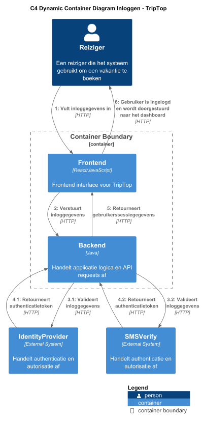

# Software Guidebook Triptop

## 1. Introduction
Dit software guidebook geeft een overzicht van de Triptop-applicatie. Het bevat een samenvatting van het volgende: 
1. De vereisten, beperkingen en principes. 
1. De software-architectuur, met inbegrip van de technologiekeuzes op hoog niveau en de structuur van de software. 
1. De ontwerp- en codebeslissingen die zijn genomen om de software te realiseren.
1. De architectuur van de infrastructuur en hoe de software kan worden geïnstalleerd.

## 2. Context
De TripTop applicatie is ontworpen als een platform voor het plannen van reizen. Gebruikers
kunnen reizen organiseren en accommodaties en vluchten boeken via externe API's die zijn
geïntegreerd in de applicatie. Reizigers en reisagenten gebruiken de applicatie voor
reisplanning, waarbij de reizigers hun reis plannen en de reisagenten ondersteuning bieden
bij het plannen van reizen.

### 2.1. Functionaliteit
De functionaliteiten van de applicatie omvatten:
* Reisplanning: Gebruikers kunnen accommodaties en vluchten boeken.
* Kaartweergave: De applicatie kan kaarten tonen met locaties van accommodaties en vluchten via
de integratie van de Google Maps API.
* Authenticatie en autorisatie: Gebruikers worden geauthenticeerd en geautoriseerd via een
externe Identity Provider.

### 2.2. Gebruikers
Het team heeft ervoor gekozen om twee typen gebruikers in de applicatie op te nemen:
* Reiziger: Dit is de belangrijkste gebruiker van de applicatie. De reiziger gebruikt
de applicatie om hun reizen te plannen, waaronder het boeken van accommodaties en het
zoeken naar geschikte vluchten.
* Reisagent: Deze gebruiker helpt de reiziger met het plannen van hun reis door advies
te geven een aanbevelingen te doen over routes, accommodaties en vluchten. De reisagent
dient als een ondersteunende rol voor de reiziger.

Deze twee gebruikersrollen zijn gekozen, omdat ze de belangrijkste actoren zijn die in
de casus worden genoemd.

### 2.3. Externe systemen
Er zijn vier externe systemen geïntegreerd in de TripTop applicatie:
1. Google Maps API

Deze API wordt gebruikt om kaarten en locaties op te vragen. Het zorgt ervoor dat gebruikers routes kunnen 
visualiseren en bestemmingen kunnen vinden binnen de applicatie.
2. Booking.com API

Via deze API kunnen gebruikers accommodaties vinden en boeken op basis van hun specifieke wensen. De 
API zorgt voor toegang tot de database van accommodaties, inclusief prijzen en beschikbaarheid.

3. AirScraper API

Deze API biedt informatie over vluchten, luchthavens en prijzen van vluchten. Het stelt gebruikers
in staat om vluchten te zoeken en te boeken die aan hun reisplannen voldoen.

4. Identity Provider

De applicatie maakt gebruik van een externe identity provider voor de authenticatie en autorisatie 
van gebruikers. Dit externe systeem zorgt ervoor dat gebruikers zich veilig kunnen aanmelden in de 
applicatie en hun identiteit wordt gecontroleerd, zonder dat de applicatie zelf verantwoordelijk is
voor het beheer van wachtwoorden of inloggegevens.

## 3. Functional Overview

Om de belangrijkste features toe te lichten zijn er user stories en twee domain stories gemaakt en een overzicht van het domein in de vorm van een domeinmodel. Op deze plek staat typisch een user story map maar die ontbreekt in dit voorbeeld.

### 3.1 User Stories

#### 3.1.1 User Story 1: Reis plannen

Als gebruiker wil ik een zelfstandig op basis van diverse variabelen (bouwstenen) een reis kunnen plannen op basis van mijn reisvoorkeuren (wel/niet duurzaam reizen, budget/prijsklasse, 's nachts reizen of overdag etc.) zodat ik op vakantie kan gaan zonder dat hiervoor een reisbureau benodigd is.

#### 3.1.2 User Story 2: Reis boeken

Als gebruiker wil ik een geplande reis als geheel of per variabele (bouwsteen) boeken en betalen zodat ik op vakantie kan gaan zonder dat hiervoor een reisbureau benodigd is.

#### 3.1.3 User Story 3: Reis cancelen

Als gebruiker wil ik een geboekte reis, of delen daarvan, kunnen annuleren zodat ik mijn geld terug kan krijgen zonder inmenging van een intermediair zoals een reisbureau.

#### 3.1.4 User Story 4: Reisstatus bewaren 

Als gebruiker wil ik mijn reisstatus kunnen bewaren zonder dat ik een extra account hoef aan te maken zodat ik mijn reis kan volgen zonder dat ik daarvoor extra handelingen moet verrichten.

#### 3.1.5 User Story 5: Bouwstenen flexibel uitbreiden

Als gebruiker wil ik de bouwstenen van mijn reis flexibel kunnen uitbreiden met een zelf te managen stap (bijv. met providers die niet standaard worden aangeboden zoals een andere reisorganisatie, hotelketen etc.) zodat ik mijn reis helemaal kan aanpassen aan mijn wensen.

### 3.2 Domain Story Reis Boeken (AS IS)

### 3.3 Domain Story Reis Boeken (TO BE)

### 3.4 Domain Model

### 3.5 Mapping Domain Model van/naar de APIs
| Class::attribuut                 | Is input voor API + Endpoint          | Wordt gevuld door API + Endpoint | Wordt geleverd door eindgebruiker | Moet worden opgeslagen in de applicatie |
|----------------------------------|---------------------------------------|----------------------------------|-----------------------------------|-----------------------------------------|
| Trip::startDatum                 |                                       |                                  | x                                 |                                         |
| Trip::eindDatum                  |                                       |                                  | x                                 |                                         |
| Trip::budget                     |                                       |                                  | x                                 |                                         |
| Verblijf::startDatum             |                                       |                                  | x                                 | x                                       |
| Verblijf::eindDatum              |                                       |                                  | x                                 | x                                       |
| Verblijfplaats::locatie          | Booking/getHotelDetails (GET)         | Booking/getHotelDetails          |                                   | x                                       |
| Verblijfplaats::prijs            | Booking/getHotelDetails (GET)         | Booking/getHotelDetails          |                                   | x                                       |
| Reis::startDatum                 | AirScraper/searchFlightsComplete(GET) | AirScraper/searchFlightsComplete |                                   | x                                       |
| Reis::eindDatum                  | AirScraper/searchFlightsComplete(GET) | AirScraper/searchFlightsComplete |                                   | x                                       |
| Reis::prijs                      | AirScraper/searchFlightsComplete(GET) | AirScraper/searchFlightsComplete |                                   | x                                       |
| Reis::vervoer                    |                                       |                                  | x                                 |                                         |
| Locatie::lat                     | Google Maps API / ?  (?)              | Google Maps API / ?              |                                   | x                                       |
| Locatie::lon                     | Google Maps API / ?  (?)              | Google Maps API / ?              |                                   | x                                       |
| Excursie::titel                  | n.v.t.                                | n.v.t.                           | n.v.t.                            | n.v.t.                                  |
| Excursie::datum                  | n.v.t.                                | n.v.t.                           | n.v.t.                            | n.v.t.                                  |
| Excursie::startTijd              | n.v.t.                                | n.v.t.                           | n.v.t.                            | n.v.t.                                  |
| Excursie::eindTijd               | n.v.t.                                | n.v.t.                           | n.v.t.                            | n.v.t.                                  |
| Excursie::prijs                  | n.v.t.                                | n.v.t.                           | n.v.t.                            | n.v.t.                                  |
| Reiziger::telefoonnummer         |                                       |                                  | x                                 | x                                       |
| Reiziger::postcode               |                                       |                                  | x                                 | x                                       |
| Reiziger::huisnummer             |                                       |                                  | x                                 | x                                       |
| Reservering::reserveringsnummer  |                                       |                                  | x                                 | x                                       |
| Reservering::status              |                                       |                                  | x                                 | x                                       |
| TriptopGebruiker::voornaam       |                                       |                                  | x                                 | x                                       |
| TriptopGebruiker::tussenvoegsels |                                       |                                  | x                                 | x                                       |
| TriptopGebruiker::achternaam     |                                       |                                  | x                                 | x                                       |
| TriptopGebruiker::email          |                                       |                                  | x                                 | x                                       |
| TriptopGebruiker::wachtwoord     |                                       |                                  | x                                 | x                                       |
| Reisbureaumedewerker::titel      |                                       |                                  | x                                 | x                                       |

## 4. Quality Attributes

Voordat deze casusomschrijving tot stand kwam, heeft de opdrachtgever de volgende ISO 25010 kwaliteitsattributen benoemd als belangrijk:
* Compatibility -> Interoperability (Degree to which a system, product or component can exchange information with other products and mutually use the information that has been exchanged)
* Reliability -> Fault Tolerance (Degree to which a system or component operates as intended despite the presence of hardware or software faults)
* Maintainability -> Modularity (Degree to which a system or computer program is composed of discrete components such that a change to one component has minimal impact on other components)
* Maintainability -> Modifiability (Degree to which a product or system can be effectively and efficiently modified without introducing defects or degrading existing product quality)
* Security -> Integrity (Degree to which a system, product or component ensures that the state of its system and data are protected from unauthorized modification or deletion either by malicious action or computer error)
* Security -> Confidentiality (Degree to which a system, product or component ensures that data are accessible only to those authorized to have access)

## 5. Constraints

> [!IMPORTANT]
> Beschrijf zelf de beperkingen die op voorhand bekend zijn die invloed hebben op keuzes die wel of niet gemaakt kunnen of mogen worden.

## 6. Principles

> [!IMPORTANT]
> Beschrijf zelf de belangrijkste architecturele en design principes die zijn toegepast in de software.

## 7. Software Architecture

###     7.1. Containers
#### Container diagram TripTop

> 

Het systeem van TripTop bestaat hier uit de volgende containers: frontend, backend en een database.
Daarnaast zijn er ook externe programma's waar de containers gebruik van maken.
De webapplicatie maakt gebruik van de Google maps api voor het tonen van een kaart.
De backend maakt gebruik van de Booking.com api voor het laten zien van hotels.
Daarnaast maakt de backend ook gebruik van de Airscraper api voor het ophalen van vluchtdata.
#### Dynamic container diagram TripTop reis boeken
> 
#### Dynamic container diagram TripTop Inloggen
> 

###     7.2. Components

> [!IMPORTANT]
> Voeg toe: Component Diagram plus een Dynamic Diagram van een aantal scenario's inclusief begeleidende tekst.
#### Component diagram TripTop Backend

Dit component diagram bestaat uit twee actoren, de containers Frontend, ExterneDatabase, drie externe systemen en componenten die weergeven hoe de backend is opgebouwd.
De frontend verzamelt de input van de twee actoren en verstuurt deze naar de backend via HTTP/JSON verzoeken. In de backend vindt de verwerking van verzoeken plaats. 
Het is opgesplitst in meerdere Java-componenten die elk verantwoordelijk zijn voor een bepaald domein:
- LoginController: verantwoordelijk voor het beheren van inlogacties.
- HotelController: verantwoordelijk voor het beheren van hotelgerelateerde acties.
- VluchtController: verantwoordelijk voor het beheren van vluchtgerelateerde acties.
- LoginService: verwerkt inlogverzoeken door gebruik te maken van de Identity Provider en stuurt deze door naar de LoginRepository.
- HotelService: Verwerkt hotelgerelateerde verzoeken en stuurt API-aanvragen naar de Booking.com API.
- VluchtService: Verwerkt vluchtgerelateerde verzoeken en stuurt API-aanvragen naar de AirScraper API.
- LoginRepository: Verantwoordelijk voor het opslaan en ophalen van inloggegevens uit de ExterneDatabase.

Doordat de backend is opgesplitst in meerdere componenten die elk verantwoordelijk zijn voor een bepaald domein, voldoet het diagram aan het Single Responsibility Principle.
Het diagram voldoet ook aan het Open/Closed Principle omdat er makkelijk nieuwe componenten toegevoegd kunnen worden zonder de bestaande code aan te passen.
> 
#### Component diagram TripTop Frontend

Dit component diagram bestaat uit twee actoren, de container Backend, een extern systeem en componenten die weergeven hoe de frontend is opgebouwd en hoe deze met de backend communiceert.
De frontend verzamelt de input van de twee actoren en verstuurt deze naar de backend via HTTP/JSON verzoeken.
- Vlucht: verantwoordelijk voor het ophalen van vluchtgegevens via de backend.
- Vliegveld: verantwoordelijk voor het ophalen van vliegveldgegevens via de backend.
- Vluchtlijst: de vluchten en vliegvelden worden in een lijst weergegeven.
- VluchtOverzicht: de vluchtlijst wordt weergeven in een overzicht.
- Hotel: verantwoordelijk voor het ophalen van hotelgegevens via de backend.
- HotelLijst: de hotels worden in een lijst weergegeven.
- HotelOverzicht: de hotellijst wordt weergegeven in een overzicht.
- Inlogformulier: formulier waarin de gebruiker zijn inloggegevens kan invullen.
- Inlog scherm: het inlogformulier wordt weergegeven waarna de ingevulde gegevens worden doorgestuurd naar de backend.
- Kaart: verantwoordelijk voor het ophalen van kaartgegevens via de backend. Geeft vliegvelden en hotels weer.
> 
###     7.3. Design & Code

> [!IMPORTANT]
> Voeg toe: Per ontwerpvraag een Class Diagram plus een Sequence Diagram van een aantal scenario's inclusief begeleidende tekst.

**Ontwerpvraag:** Hoe ga je om met aanroepen van externe services die niet beschikbaar zijn en toch verwacht wordt dat er waardevolle output gegeven wordt?
> 
> 
>Het idee achter dit ontwerp is dat er een fallback wordt gegeven als de externe service niet beschikbaar is. Dit kan bijvoorbeeld een standaard waarde zijn of een foutmelding. Dit zorgt ervoor dat de applicatie niet vastloopt als de externe service niet beschikbaar is.
>Het voldoet aan het Single Responsibility Principle omdat de verantwoordelijkheid van het geven van een fallback waarde bij de FallbackService ligt, terwijl de foutafhandelingslogica in de strategiën zelf zit. 
> Het voldoet ook aan het Open/Closed Principle omdat er makkelijk nieuwe fallbacks toegevoegd kunnen worden zonder de bestaande code aan te passen.
>
>

**Ontwerpvraag:** Hoe kunnen we ervoor zorgen dat een bouwsteen alleen bepaalde acties toestaat wanneer deze zich in een specifieke toestand bevindt?
>
>
>Het design pattern dat ik heb gekozen voor deze ontwerpvraag is het state pattern. Ik heb hiervoor gekozen om dat de ontwerpvraag ook gaat over toestanden.
>Het klasse diagram houd zich ook aan het program to interface pricinpe door gebruikt te maken van interfaces en alleen aan te roepen via de intefaces.
>Het klasse diagram voldoet ook aan het open/ closed principe, want door interfaces te gebruiken zouden de klasse minder snel veranderen maar wel makkelijk uitbreiden.
>

## 8. Architectural Decision Records

> [!IMPORTANT]
> Voeg toe: 3 tot 5 ADR's die beslissingen beschrijven die zijn genomen tijdens het ontwerpen en bouwen van de software.

### 8.1. ADR-001 Keuze van Google Maps API voor kaartgegevens

#### Context

De TripTop applicatie moet kaartgegevens op kunnen halen voor het bereiken van de reisbestemming.

#### Considered Options

| Forces          | Google Maps API | OpenStreetMap | Mapbox |
| --------------- | --------------- | ------------- | ------ |
| Kosten          | +               | ++            | -      |
| Grootte dataset | ++              | 0             | +      |
| Eenvoud         | 0               | -             | 0      |

#### Decision

We hebben gekozen voor de Google Maps API omdat het op alle criteria relatief positief scoort.

#### Status

Accepted

#### Consequences

Afhankelijk van een closed source bron, rate limits of pricing zouden veranderd kunnen worden.

### 8.2. ADR-002 Booking.com Api

#### Context

We moeten een manier vinden om met een externe api informatie op te halen over hotels. Dit doen we via RapidAPI zijn website

#### Considered Options

|Forces | Booking.com | Hotels |
|---|---|---|
| prijs | 0 | 0 |
| up to date | + | - |
| amount of available data | + | - |
| example data | + | - |

#### Decision

We hebben gekozen voor Booking.com, omdat deze api ons veel data bied. Daarnaast wordt deze regulier geüpdatet en worden er vragen beantwoord door de maker. Ook geeft deze api veel voorbeeld data wat helpt met het uitwerken van features.

#### Status
Accepted

#### Consequences

> Toegang tot actuele gegevens: Met deze API kunnen ontwikkelaars real-time gegevens van Booking.com integreren in hun applicaties, wat zorgt voor up-to-date informatie voor gebruikers.​

> Flexibiliteit in datagebruik: De API stelt ontwikkelaars in staat specifieke gegevens op te halen en te gebruiken volgens hun behoeften, wat de flexibiliteit en functionaliteit van hun applicaties vergroot.​

> Afhankelijkheid van externe bronnen: Bij het gebruik van de API ben je afhankelijk van de prestaties en betrouwbaarheid van de externe applicatie. Problemen aan de kant van Booking.com kunnen direct invloed hebben op de functionaliteit van jouw applicatie.

> Limiet op gratis gebruik; Bij het gebruiken van deze APi hebben we een limiet aan gratis gebruik. Als deze API in een volledige applicatie wordt gebruikt met veel gebruikers zou het geld gaan kosten om hem goed te gebruiken

### 8.3. ADR-003 TITLE

> [!TIP]
> These documents have names that are short noun phrases. For example, "ADR 1: Deployment on Ruby on Rails 3.0.10" or "ADR 9: LDAP for Multitenant Integration". The whole ADR should be one or two pages long. We will write each ADR as if it is a conversation with a future developer. This requires good writing style, with full sentences organized into paragraphs. Bullets are acceptable only for visual style, not as an excuse for writing sentence fragments. (Bullets kill people, even PowerPoint bullets.)

#### Context

> [!TIP]
> This section describes the forces at play, including technological, political, social, and project local. These forces are probably in tension, and should be called out as such. The language in this section is value-neutral. It is simply describing facts about the problem we're facing and points out factors to take into account or to weigh when making the final decision.

#### Considered Options

> [!TIP]
> This section describes the options that were considered, and gives some indication as to why the chosen option was selected.

#### Decision

> [!TIP]
> This section describes our response to the forces/problem. It is stated in full sentences, with active voice. "We will …"

#### Status

> [!TIP]
> A decision may be "proposed" if the project stakeholders haven't agreed with it yet, or "accepted" once it is agreed. If a later ADR changes or reverses a decision, it may be marked as "deprecated" or "superseded" with a reference to its replacement.

#### Consequences

> [!TIP]
> This section describes the resulting context, after applying the decision. All consequences should be listed here, not just the "positive" ones. A particular decision may have positive, negative, and neutral consequences, but all of them affect the team and project in the future.

### 8.4. ADR-004 TITLE

> [!TIP]
> These documents have names that are short noun phrases. For example, "ADR 1: Deployment on Ruby on Rails 3.0.10" or "ADR 9: LDAP for Multitenant Integration". The whole ADR should be one or two pages long. We will write each ADR as if it is a conversation with a future developer. This requires good writing style, with full sentences organized into paragraphs. Bullets are acceptable only for visual style, not as an excuse for writing sentence fragments. (Bullets kill people, even PowerPoint bullets.)

#### Context

> [!TIP]
> This section describes the forces at play, including technological, political, social, and project local. These forces are probably in tension, and should be called out as such. The language in this section is value-neutral. It is simply describing facts about the problem we're facing and points out factors to take into account or to weigh when making the final decision.

#### Considered Options

> [!TIP]
> This section describes the options that were considered, and gives some indication as to why the chosen option was selected.

#### Decision

> [!TIP]
> This section describes our response to the forces/problem. It is stated in full sentences, with active voice. "We will …"

#### Status

> [!TIP]
> A decision may be "proposed" if the project stakeholders haven't agreed with it yet, or "accepted" once it is agreed. If a later ADR changes or reverses a decision, it may be marked as "deprecated" or "superseded" with a reference to its replacement.

#### Consequences

> [!TIP]
> This section describes the resulting context, after applying the decision. All consequences should be listed here, not just the "positive" ones. A particular decision may have positive, negative, and neutral consequences, but all of them affect the team and project in the future.

### 8.5. ADR-005 TITLE

> [!TIP]
> These documents have names that are short noun phrases. For example, "ADR 1: Deployment on Ruby on Rails 3.0.10" or "ADR 9: LDAP for Multitenant Integration". The whole ADR should be one or two pages long. We will write each ADR as if it is a conversation with a future developer. This requires good writing style, with full sentences organized into paragraphs. Bullets are acceptable only for visual style, not as an excuse for writing sentence fragments. (Bullets kill people, even PowerPoint bullets.)

#### Context

> [!TIP]
> This section describes the forces at play, including technological, political, social, and project local. These forces are probably in tension, and should be called out as such. The language in this section is value-neutral. It is simply describing facts about the problem we're facing and points out factors to take into account or to weigh when making the final decision.

#### Considered Options

> [!TIP]
> This section describes the options that were considered, and gives some indication as to why the chosen option was selected.

#### Decision

> [!TIP]
> This section describes our response to the forces/problem. It is stated in full sentences, with active voice. "We will …"

#### Status

> [!TIP]
> A decision may be "proposed" if the project stakeholders haven't agreed with it yet, or "accepted" once it is agreed. If a later ADR changes or reverses a decision, it may be marked as "deprecated" or "superseded" with a reference to its replacement.

#### Consequences

> [!TIP]
> This section describes the resulting context, after applying the decision. All consequences should be listed here, not just the "positive" ones. A particular decision may have positive, negative, and neutral consequences, but all of them affect the team and project in the future.

## 9. Deployment, Operation and Support

> [!TIP]
> Zelf beschrijven van wat je moet doen om de software te installeren en te kunnen runnen.